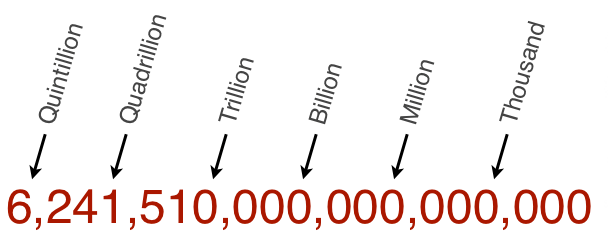
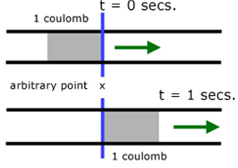

From 2010 to 2019 in Ontario

### Why we need to be safe around electricity

In the past ten years, there were 142 electrical fatalities in Ontario. From 2012 to 2021, 53 people died from
electrocution (non-intentional death caused by contact with electricity) or by the effects of electrical burns. it is important that we are made aware of the electrical hazards that are present in the work area. 

### The basics of electricity.

All materials are made up of building blocks called atoms and within these atoms there are three major types of particles. 

1. the Neutron.
2. the proton.
3. the electron.  

The charged particles in the atom have a physical field that repels or attracts like or opposing charges. 
These fields are an important property of these particles and are essential to the working of electricity. 

## What is electricity?
Electricity is the *flow* of charged particles (electrons or protons) through a *material or space*.

### Measuring flow
There are two components to measuring electrical flow. 
1. The measurement of flow. 
2. The ability of the material to allow flow.
#### The Coulomb
The charge created by the following number of particles. 

#### The Ampere
The movement of one coulomb past a point in one second. 
The Ampere or amp can be further divided, for example the milliamp is one thousandth of a coulomb past a point in one second.
 

### The medium.
The materials carrying electricity have properties that affect and determine the flow of electricity.
#### Electrical flow in a material

Electricity will flow when it is able to push electrons from the atoms of a material and replace them until the flow reaches the other end.  
##### Conductive materials

Flow in a conductive material is easy because the outerrmost electrons are easily moved.  
##### Insulator materials

Flow in insulators is difficult because it requires more force to push electrons to flow.  

!!!note
    All materials have a dielectric strength that when exceeded turns them into conductors.
    Conductive values are based on sugggested uses and adhering to safety regulations/rules.

#### Measuring resistance of a material
Resistance of a material to electrical flow is measured in Ohms(Ω).

#### Properties that affect resistance of a material.

##### Length of the material
The resistance of a metallic conductor is directly proportional to its length. 
the longer the electrons have to travel the more work needs to be done to move them. 
In the cable industry we lose more signal strength the further the signal has to be pushed. 

 

##### cross section 
The larger the conductor is the lower the resistance is.
For example a wire with a 3mm diameter will have 4 times the resitance of a 6mm diameter wire.
Again, in the cable industry this is why thicker cable is used for longer distances.

##### Temperature
A higher temperature will increase the resistance of a material due to the higher activity of the materials particles.

##### Voltage
Voltage is the work needed to move a set charge between two points.  
This is expressed as joules per coulomb, where 1 volt = 1 joule (of work) per 1 coulomb (of charge).  

#### Ohms law
Ohms law states that you can calculate any missing measuremenent using the other two measurements. 

